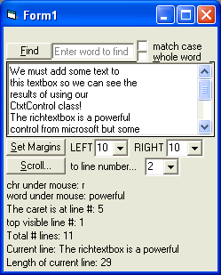



## CtextboxControl: a class that encapsulates tons of hidden actions that can be performed on textboxes

### Description

This is a class that allows you to have much greater control over your textboxes, regular or rich. Such things as getting the character and the word the mouse is over to getting the top visible line to scrolling the textbox with code plus many many more.
 
### More Info
 

             |
---                |---
**Submitted On**   |2006-01-09 19:15:38
**By**             |[dan aprobee](https://github.com/Planet-Source-Code/PSCIndex/blob/master/ByAuthor/dan-aprobee.md)
**Level**          |Intermediate
**User Rating**    |5.0 (10 globes from 2 users)
**Compatibility**  |VB 5\.0, VB 6\.0
**Category**       |[Coding Standards](https://github.com/Planet-Source-Code/PSCIndex/blob/master/ByCategory/coding-standards__1-43.md)
**World**          |[Visual Basic](https://github.com/Planet-Source-Code/PSCIndex/blob/master/ByWorld/visual-basic.md)
**Archive File**   |[CtextboxCo196391192006\.zip](https://github.com/Planet-Source-Code/dan-aprobee-ctextboxcontrol-a-class-that-encapsulates-tons-of-hidden-actions-that-can-be-p__1-63992/archive/master.zip)

